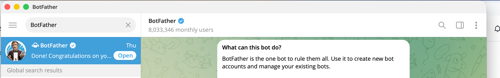
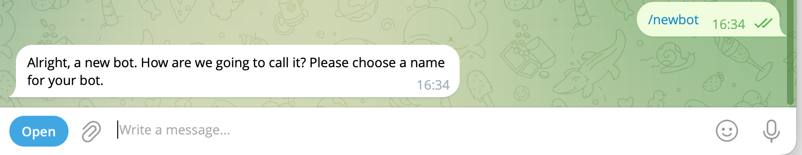
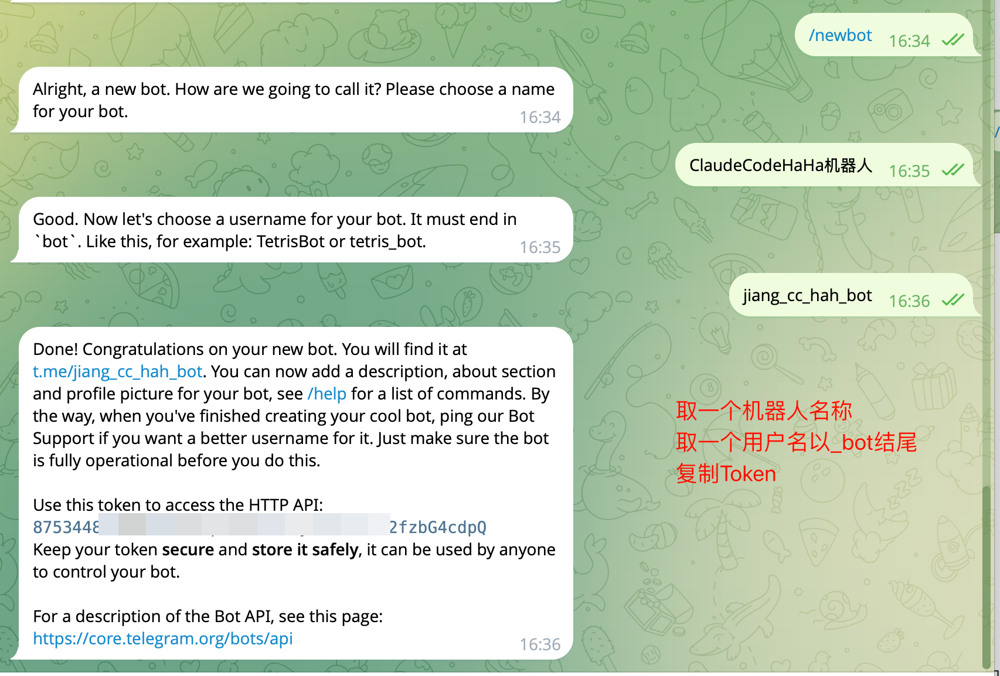
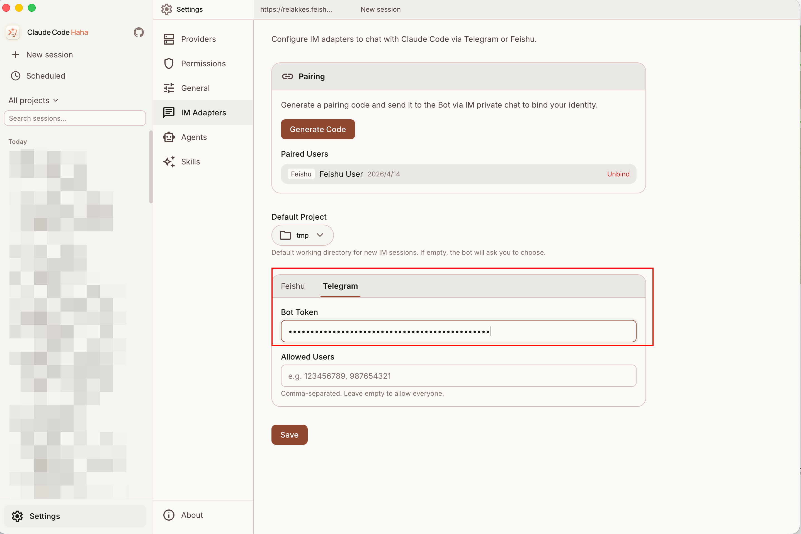
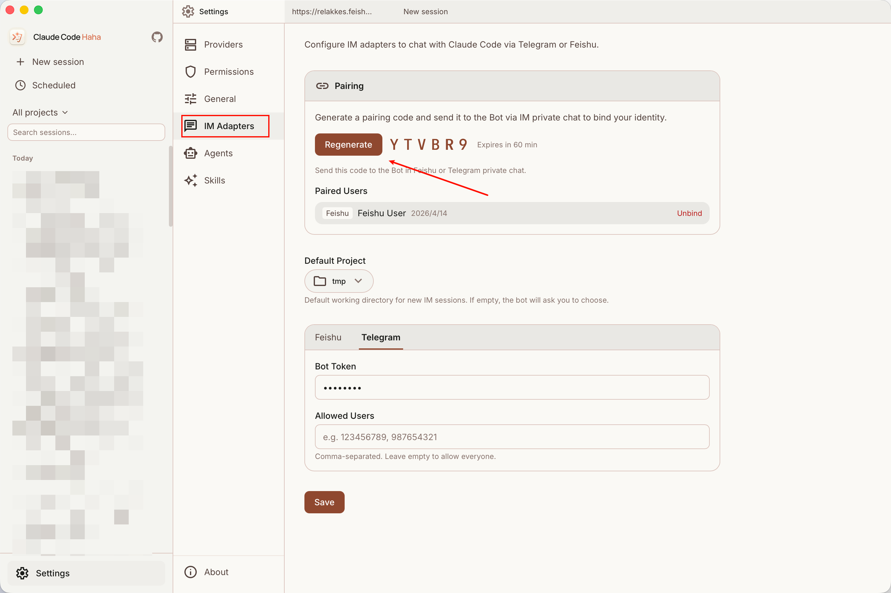
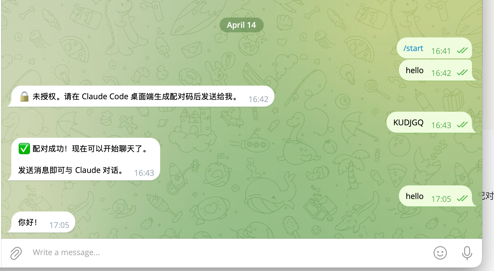

# Telegram 接入

> Telegram Adapter 的接入教程。找 BotFather 拿 Token，桌面端填完配对即可。

## 适用场景

Telegram 方案适合个人私聊远程使用。当前实现只处理 `private chat`，不处理群聊。

实现入口：`adapters/telegram/index.ts`

## 1. 创建 Telegram 机器人

在 Telegram 里搜索官方账号 **@BotFather**：



给它发送 `/newbot`：



按提示走完三步：

- **取一个机器人名称**，例如 `ClaudeCodeHaha机器人`
- **取一个机器人用户名**，要求全英文字母，且必须以 `_bot` 结尾，例如 `jiang_cc_hah_bot`
- 创建成功后，复制 BotFather 返回的 **Bot Token**



## 2. 在 Claude Code Haha 桌面端填写

### 2.1 填写 Bot Token

打开桌面端 `设置 → IM 接入 → Telegram`，把上一步的 Bot Token 填进去：



### 2.2 生成配对码

点击「生成配对码」按钮，拿到 6 位配对码后点击保存：



## 3. 机器人与桌面端配对

随便给刚才创建的机器人发送一条消息，按提示输入配对码。看到下面的配对成功提示，就可以从手机 Telegram 远程驱动桌面端 Claude Code Haha 了：



## 支持的命令

- `/start` — 显示帮助和可用命令
- `/projects` — 切换项目，重新显示最近项目列表
- `/status` — 查看当前会话的项目、模型、运行状态和任务摘要
- `/clear` — 清空当前会话上下文，保留项目绑定
- `/new` — 清空当前 chat 绑定的 session，并重新选择项目
- `/help` — 显示当前可用命令
- `/stop` — 向当前 session 发送 `stop_generation`

## 权限审批

当 Claude 请求敏感权限时，Telegram adapter 会发带按钮的消息：

- `✅ 允许`
- `❌ 拒绝`

点击后 adapter 会把结果通过 `permission_response` 回传给 Desktop server。

## 返回消息的表现

Telegram 侧有一层流式缓冲：

- thinking 时先发占位消息
- text delta 逐步累积
- 完成时按 4000 字分片发送

对应公共模块：

- `adapters/common/message-buffer.ts`
- `adapters/common/format.ts`
- `adapters/common/ws-bridge.ts`

## 启动 adapter

桌面端会自动把 adapter 作为 sidecar 拉起。如果你在本地开发，需要手动启动：

```bash
cd adapters
bun install
bun run telegram
```

## 环境变量覆盖（可选）

```bash
export TELEGRAM_BOT_TOKEN="123456:ABC-DEF..."
export ADAPTER_SERVER_URL="ws://127.0.0.1:3456"
```

## 常见问题

### bot 启动时报缺少 token

说明 `TELEGRAM_BOT_TOKEN` 和 `~/.claude/adapters.json` 里的 `telegram.botToken` 都没有生效。

### 能打开设置页但 bot 不工作

Webapp 只负责配置，不会自动拉起 `bun run telegram`（桌面端发布版会通过 sidecar 自动拉起）。

### 发消息提示未授权

- 是否已经在桌面端生成配对码
- 配对码是否在 60 分钟有效期内
- 是否把码发到了正确的 bot 私聊
- 连续输错会有速率限制，等几分钟再试

### 每次重启后会话丢失

检查 `~/.claude/adapter-sessions.json` 是否能正常写入，以及 Desktop server 的 session 是否仍存在。

## 源码入口

- `adapters/telegram/index.ts`
- `adapters/common/pairing.ts`
- `adapters/common/session-store.ts`
- `adapters/common/ws-bridge.ts`
- `adapters/common/http-client.ts`
